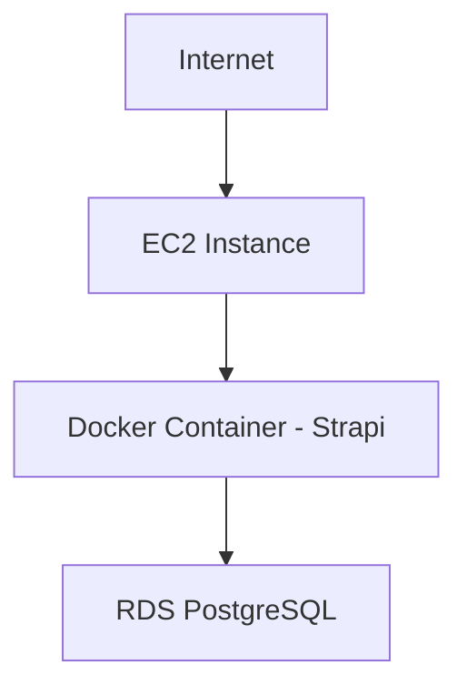

# 🌌 NebulaStack  
### 🚀 Production‑Grade Cloud Native Deployment | Docker • AWS • Terraform • PostgreSQL

<p align="center">
  
  
  
  
  
</p>

---

# ✨ Overview

NebulaStack is a fully containerized, production‑ready cloud deployment demonstrating real-world DevOps, Cloud Engineering, and Infrastructure-as-Code practices.

This system deploys a Strapi backend inside a Docker container hosted on Amazon EC2, connected securely to Amazon RDS PostgreSQL, provisioned entirely via Terraform.

---

# 🏗️ High-Level Architecture



---

# 🧠 Core Engineering Principles

- Infrastructure as Code (Terraform)
- Immutable Docker Images
- Versioned Container Deployment (Git SHA Tagging)
- Secure Networking via Security Groups
- SSL Database Connectivity
- IAM Least Privilege Access
- Stateless Container Architecture

---

# 🐳 Containerization Strategy

## Dockerfile Design

- Base Image: `node:20-alpine`
- Production dependency installation
- Application build stage included
- Environment variable driven configuration
- Optimized for minimal attack surface

### Build Command

```bash
docker build --no-cache -t nebulastack-strapi .
```

---

# 📦 Image Versioning Strategy

Each deployment is tagged using Git commit SHA.

```bash
git rev-parse --short HEAD
docker tag nebulastack-strapi <ECR_URI>:<COMMIT_SHA>
docker push <ECR_URI>:<COMMIT_SHA>
```

This ensures:

- Deterministic deployments
- Traceable rollback capability
- Immutable production artifacts

---

# ☁️ Infrastructure Provisioning (Terraform)

## Provisioned AWS Resources

- EC2 (t2.micro)
- RDS PostgreSQL (db.t3.micro)
- IAM Role (ECR ReadOnly)
- IAM Instance Profile
- VPC + Subnets
- Security Groups
- User Data Bootstrapping Script

### Initialize

```bash
terraform init
```

### Plan

```bash
terraform plan -var="key_name=nebula-key" -var="image_tag=<SHA>"
```

### Apply

```bash
terraform apply -var="key_name=nebula-key" -var="image_tag=<SHA>"
```

---

# 🔐 Security Architecture

## Database Access Model

❌ No Public Database Access  
✅ EC2 Security Group → Allowed  
❌ 0.0.0.0/0 Removed  

## Security Layers

- IAM Role with restricted ECR permissions
- Private SSH key not committed
- Environment-based secrets injection
- SSL enforced for PostgreSQL

### Strapi SSL Configuration

```ts
ssl: {
  rejectUnauthorized: false,
}
```

---

# 🛢️ Database Layer

## Amazon RDS PostgreSQL

- Engine: PostgreSQL
- Public Access: Disabled
- SSL Enabled
- Managed backups
- Secure subnet group

---

# 🚀 Deployment Flow

```text
Code Change
   ↓
Git Commit
   ↓
Docker Build
   ↓
Tag with SHA
   ↓
Push to ECR
   ↓
EC2 Pull Image
   ↓
Container Starts
   ↓
Connects Securely to RDS
```

---

# 🌍 Public Endpoint

```
http://<EC2_PUBLIC_IP>/admin
```

---

# 📂 Repository Structure

```
NebulaStack/
│
├── app/
│   ├── config/
│   ├── src/
│   ├── public/
│   ├── Dockerfile
│   └── package.json
│
├── infra/
│   ├── ec2/
│   ├── rds/
│   ├── main.tf
│   ├── variables.tf
│   └── userdata.sh
│
└── README.md
```

---

# 🧩 Environment Variables

```
DATABASE_CLIENT=postgres
DATABASE_HOST=<RDS_ENDPOINT>
DATABASE_PORT=5432
DATABASE_NAME=postgres
DATABASE_USERNAME=<USER>
DATABASE_PASSWORD=<PASSWORD>
APP_KEYS=<KEYS>
API_TOKEN_SALT=<SALT>
ADMIN_JWT_SECRET=<SECRET>
JWT_SECRET=<SECRET>
```

---

# 📈 Engineering Challenges Solved

- Docker daemon permission issues
- ECR authentication errors
- pg_hba.conf SSL enforcement
- RDS security group misconfiguration
- Terraform state inconsistencies
- IAM role misbinding
- Windows Git permission lock issues

---

# 🔄 Future Enhancements

- CI/CD via GitHub Actions
- Nginx Reverse Proxy + HTTPS
- Elastic IP Assignment
- Load Balancer Integration
- ECS Migration
- Secrets Manager Integration
- Blue-Green Deployment
- Monitoring with CloudWatch

---

# 🏁 Conclusion

NebulaStack represents a real-world, production-style cloud deployment integrating containerization, cloud networking, secure database management, and Infrastructure-as-Code.

This project demonstrates hands-on DevOps capability beyond theoretical implementation and reflects production engineering standards used in scalable systems.

---

<p align="center">
  <b>Built with Cloud-Native Engineering Principles</b>
</p>

